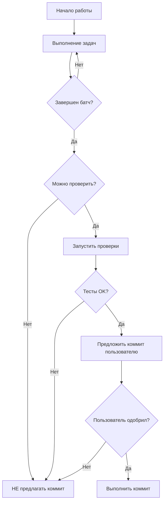

# 🤖 Workflow для AI Агента - Интеграция процессов

## 📋 Обзор

Этот документ описывает интеграцию `GIT_WORKFLOW.md` в процессы разработки и работу AI агента.

---

## 🔗 Связь с документами

### Основные документы:

1. **`GIT_WORKFLOW.md`** - Полное руководство по Git коммитам
2. **`.cursorrules_git_workflow`** - Правила для AI агента (технический файл)
3. **`TESTING_PLAN.md`** - Может содержать commit steps (показывают ЧТО, не КОГДА)
4. **`REMAINING_TASKS.md`** - Может содержать commit steps в планах задач

---

## 🎯 Принципы интеграции

### 1. Разделение ответственности

```
План (Plan Writing)          →  Выполнение (Execution)
─────────────────────           ───────────────────
✅ Может содержать commit      ❌ НЕ делает авто-коммиты
   steps (ЧТО закоммитить)        ✅ Всегда спрашивает пользователя
✅ Показывает структуру            ✅ Ждет подтверждения
```

### 2. Workflow агента



---

## 📝 Интеграция в планы задач

### В планах (TESTING_PLAN.md, REMAINING_TASKS.md)

Планы могут содержать commit steps как часть задач:

```markdown
### Задача: Добавить unit тесты

1. Создать файл `backend/trpc/routes/sync/merge-logic.test.ts`
2. Написать тесты для merge логики
3. Запустить тесты: `bun test`
4. **Коммит (после проверки)**: `test: добавлены unit тесты для merge логики`
```

**Важно**: Это показывает ЧТО закоммитить, но НЕ означает авто-коммит!

### При выполнении агентом:

```typescript
// ✅ ПРАВИЛЬНО: Агент выполняет задачи 1-3
// После успешного завершения:

// 1. Проверяет результаты
await runCommand('bun test');  // Все тесты проходят
await runCommand('bunx tsc --noEmit');  // Нет ошибок

// 2. Предлагает коммит пользователю (НЕ выполняет)
console.log(`
✅ Задачи завершены. Все тесты проходят (42/42).
Предлагаю закоммитить: 'test: добавлены unit тесты для merge логики'
Выполнить коммит? (y/n)
`);

// 3. Ждет подтверждения пользователя
// Только после явного "y" или подтверждения выполняет коммит
```

---

## 🔄 Процесс работы агента

### Шаг 1: Выполнение задач

Агент выполняет задачи из плана:
- Создание файлов
- Написание кода
- Модификация существующего кода

### Шаг 2: Проверка (перед предложением коммита)

Агент проверяет:
```bash
# Проверка тестов
bun test
# Ожидаемый результат: Все тесты проходят

# Проверка TypeScript
bunx tsc --noEmit
# Ожидаемый результат: Нет ошибок

# Проверка линтера (если применимо)
bun run lint
# Ожидаемый результат: Нет ошибок
```

### Шаг 3: Предложение коммита (не выполнение)

Агент НЕ выполняет коммит автоматически, а предлагает:

```markdown
✅ Работа завершена. Проверки пройдены:
- Тесты: 42/42 проходят ✅
- TypeScript: Нет ошибок ✅
- Линтер: Нет ошибок ✅

Предлагаю закоммитить:
Commit: "test: добавлены unit тесты для merge логики"

Выполнить коммит? (требуется подтверждение)
```

### Шаг 4: Ожидание подтверждения

Агент ждет явного подтверждения от пользователя:
- "y" / "yes" / "да"
- Или явное указание выполнить коммит

### Шаг 5: Выполнение коммита (только после подтверждения)

```bash
git add .
git commit -m "test: добавлены unit тесты для merge логики"
```

---

## 📊 Чеклист для агента

Перед предложением коммита агент должен проверить:

- [ ] **Работа завершена** - логическая единица работы завершена
- [ ] **Тесты проходят** - `bun test` показывает все тесты проходят
- [ ] **TypeScript OK** - `bunx tsc --noEmit` не показывает ошибок
- [ ] **Линтер OK** - `bun run lint` не показывает ошибок (если применимо)
- [ ] **Нет очевидных ошибок** - код выглядит корректно
- [ ] **Есть естественная точка паузы** - завершение батча задач
- [ ] **Агент может проверить** - результаты проверяемы автоматически

**Если хотя бы один пункт не выполнен → НЕ предлагать коммит**

---

## 🚫 Запрещенные действия

### ❌ Никогда не делать:

1. **Автоматический коммит без подтверждения**
   ```bash
   # ❌ НЕПРАВИЛЬНО
   git commit -m "fix: исправлена ошибка"
   ```

2. **Коммит в середине незавершенной работы**
   ```bash
   # ❌ НЕПРАВИЛЬНО: Реализовано 50% функции
   git commit -m "feat: частичная реализация"
   ```

3. **Коммит без проверки тестов**
   ```bash
   # ❌ НЕПРАВИЛЬНО: Тесты не запускались
   git commit -m "test: добавлены тесты"
   ```

4. **Коммит когда требуется ручная проверка**
   ```bash
   # ❌ НЕПРАВИЛЬНО: "Пожалуйста, проверьте работу приложения"
   # (Коммит до проверки пользователем)
   ```

---

## ✅ Правильные действия

### ✅ Всегда делать:

1. **Предлагать коммит после проверки**
   ```markdown
   ✅ Работа завершена. Тесты проходят (42/42).
   Предлагаю закоммитить: "test: добавлены unit тесты"
   Выполнить коммит?
   ```

2. **Ждать подтверждения пользователя**
   ```typescript
   // Агент ждет ответа пользователя
   // Только после "y" / "yes" / "да" выполняет коммит
   ```

3. **Использовать правильный формат сообщений**
   ```bash
   # ✅ ПРАВИЛЬНО
   git commit -m "test: добавлены unit тесты для merge логики"
   ```

---

## 🔧 Техническая интеграция

### Файлы конфигурации:

1. **`.cursorrules_git_workflow`** - Правила для AI агента
   - Загружается автоматически Cursor
   - Содержит краткие инструкции

2. **`GIT_WORKFLOW.md`** - Полная документация
   - Референс для разработчиков
   - Детальное описание процесса

3. **Планы задач** - Могут содержать commit steps
   - Показывают ЧТО закоммитить
   - Не диктуют КОГДА коммитить

---

## 📚 Связанные документы

- [`GIT_WORKFLOW.md`](./GIT_WORKFLOW.md) - Полное руководство по Git коммитам
- [`TESTING_PLAN.md`](./TESTING_PLAN.md) - План тестирования (может содержать commit steps)
- [`REMAINING_TASKS.md`](./REMAINING_TASKS.md) - Оставшиеся задачи (может содержать commit steps)
- [`.cursorrules_git_workflow`](./.cursorrules_git_workflow) - Правила для AI агента

---

## 🎯 Итоговые правила для агента

1. ✅ **Планы могут содержать commit steps** - это нормально
2. ✅ **Выполнение НЕ делает авто-коммиты** - всегда спрашивать
3. ✅ **Предлагать коммиты только после проверки** - тесты, typecheck, lint
4. ✅ **Использовать естественные точки паузы** - завершение батча
5. ✅ **Уважать ответственность пользователя** - тесты, проверки

---

**Последнее обновление**: 2025-01-06  
**Версия**: 1.0


